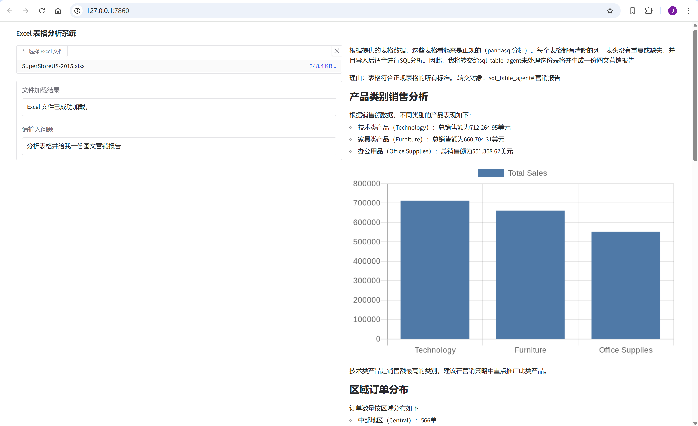
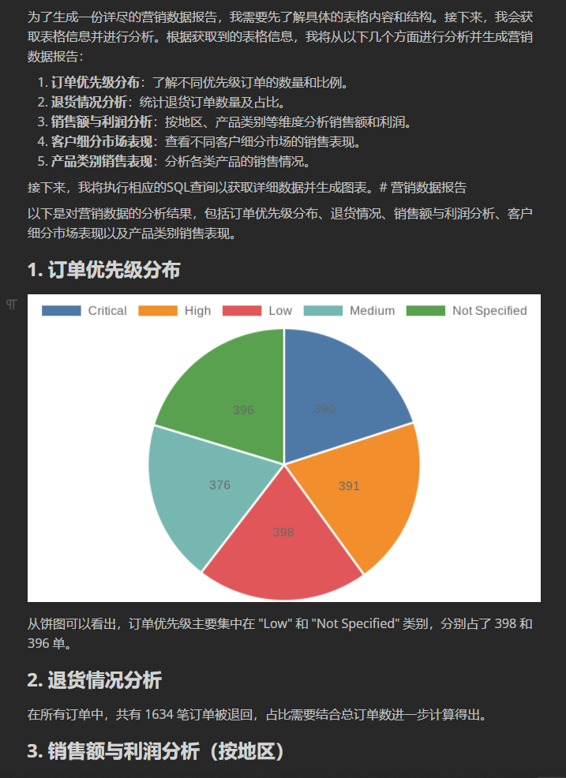

# Chat-Excel 项目

## 项目介绍
此仓库 `chat-excel` 是一个基于Python使用了LLamaIndex实现的项目，旨在借助大语言模型处理Excel数据。它能读取Excel文件，将各工作表加载为 `DataFrame`。用户可输入问题，项目会利用代理生成SQL查询，对Excel数据开展统计分析。

## 主要功能
- 读取Excel文件，加载工作表数据。
- 借助 `FunctionAgent` 分析用户问题，生成SQL查询。
- 批量执行SQL查询，返回分析结果。
- 验证表格规范性，避免不规则格式数据影响分析。
- 支持多工作表查询。
- 支持gradio界面，方便用户交互。
- 支持Markdown格式导出，可以用Markdown编辑器打开和转换。、
- 支持带有合并单元格的非正规表分析

## 输出示例
截图如下:




## 核心代码
### 主程序
`main.py`：主程序，负责读取文件、处理用户问题。

### 工具函数
定义多个工具函数，如获取表名、判断表格规范性、执行SQL查询等。

### 代理配置
配置 `FunctionAgent`，指导其处理表格相关问题。

## 安装与使用
### 安装依赖
```bash
pip install -r requirements.txt
```
requirements.txt的生成命令:
```bash
pipreqs ./ --encoding=utf8 --force
```

### 运行项目
```bash
python main.py
```
## 注意事项
- 确保Excel文件路径正确。
- 确保文件规范性，避免数据格式错误，不允许合并单元格。
- 确保正确设置了环境变量。

## todo
- 优化交互界面体验
- 支持更多的功能